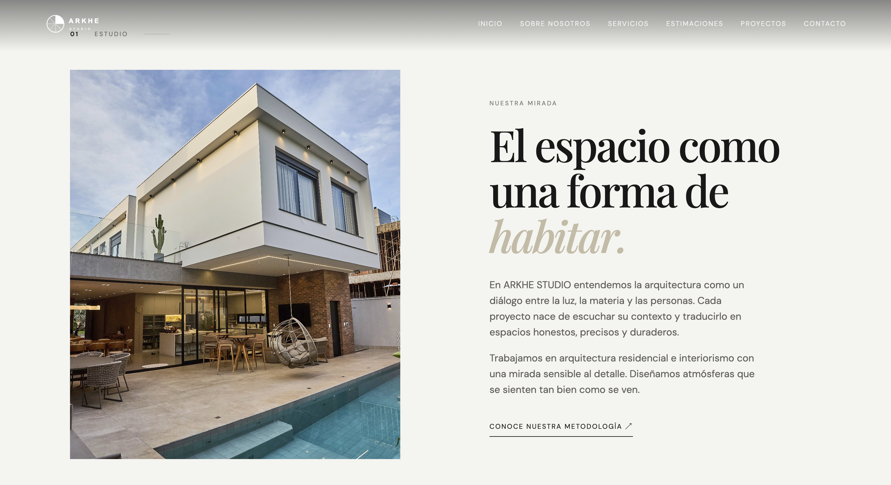
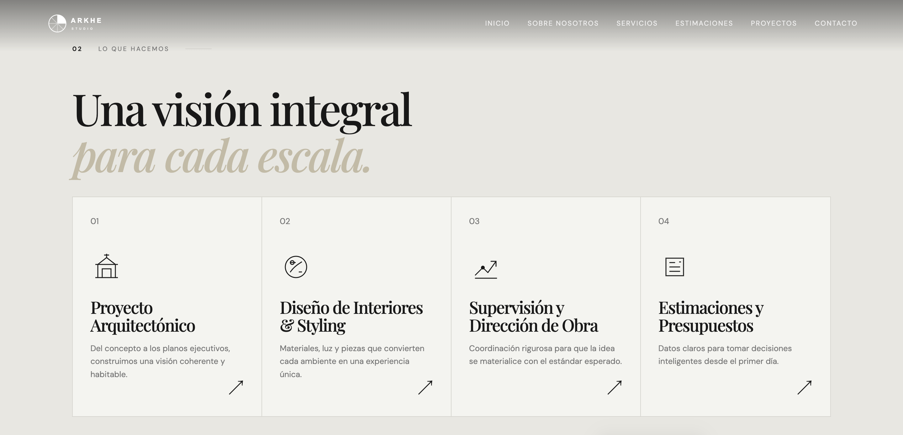
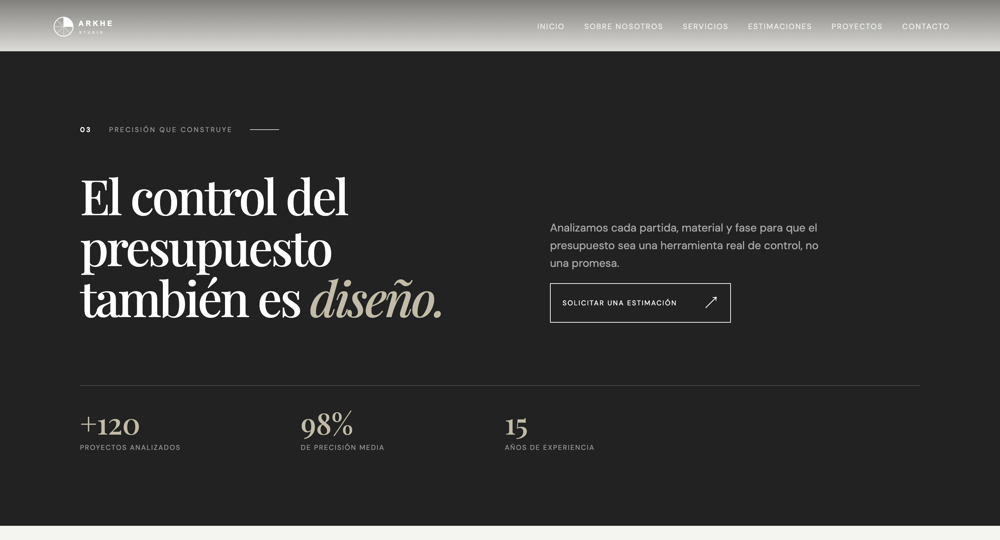
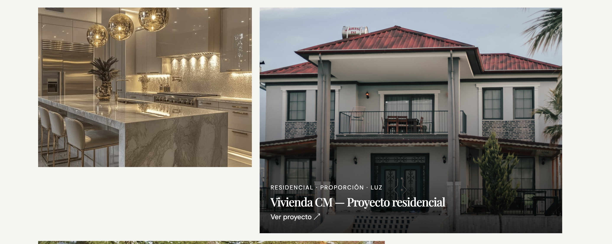
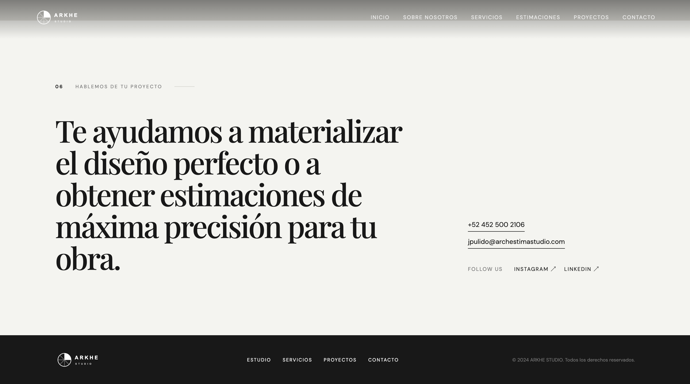

# ARKHE STUDIO — Architecture & Design Portfolio

## Descripción General

ARKHE STUDIO es una plataforma web desarrollada bajo una línea estética editorial, minimalista y de alto impacto visual. El proyecto busca proyectar sofisticación en el área de la arquitectura residencial, el diseño de interiores y la estimación precisa de costes de obra. La interfaz prioriza la legibilidad, la jerarquía tipográfica contrastada y una experiencia de navegación fluida.

---
## Visualización del proyecto

https://arkhestudio-01.netlify.app/

## Estructura y Secciones del Proyecto

### Sección Héroe (Pantalla Principal)

**Descripción de la interfaz:**
La sección principal de bienvenida implementa una imagen a pantalla completa con una propiedad de diseño contemporáneo y piscina integrada, sobre la cual se aplica una capa sutil de contraste para garantizar la legibilidad del texto principal (*"Soluciones arquitectónicas & estimación de alta precisión"*). Cuenta con una barra de navegación superior minimalista y un botón de llamada a la acción (*Call to Action*) para dirigir al usuario hacia la galería de proyectos.

---

### Sobre El Estudio (Nuestra Mirada)

**Descripción de la interfaz:**
Sección estructurada en un maquetado asimétrico de dos columnas. A la izquierda se presenta un registro fotográfico de una residencia moderna con integración de espacios interiores y exteriores, mientras que a la derecha se expone la filosofía conceptual del estudio (*"El espacio como una forma de habitar"*), utilizando tipografía serif de gran escala en combinación con texto de cuerpo refinado.

---

### Servicios Integrales

**Descripción de la interfaz:**
Módulo que detalla las áreas de especialización del estudio (*Proyecto Arquitectónico, Diseño de Interiores & Styling, Supervisión y Dirección de Obra, Estimaciones y Presupuestos*). Cada servicio está dispuesto en una retícula modular limpia con numeración dedicada, iconos geométricos abstractos e indicadores de interacción para desplegar mayor información.

---

### Estimaciones y Control Presupuestario

**Descripción de la interfaz:**
Bloque de alto contraste con fondo oscuro (*dark mode*) diseñado para destacar la propuesta de valor técnica del estudio (*"El control del presupuesto también es diseño"*). Incorpora un panel de métricas clave que exhibe estadísticas relevantes (+120 proyectos analizados, 98% de precisión media, 15 años de experiencia) y un botón de interacción directa para solicitar presupuestos.

---

### Galería de Proyectos — Portafolio (Destacado)

**Descripción de la interfaz:**
Vista detallada de obra en formato editorial. Expone fotografías de gran formato acompañadas por fichas conceptuales del proyecto (*"Casa MH — Vista interior"*), destacando las variables de diseño, materialidad, luz y proporción que definen la propuesta atemporal del estudio.

---

### Selección de Obras Residenciales e Interiorismo

**Descripción de la interfaz:**
Módulo de la galería dispuesto en tarjetas dinámicas que combinan capturas de diseño de interiores (*cocinas integradas de alta gama*) y arquitectura residencial (*"Vivienda CM — Proyecto residencial"*). Cada tarjeta integra un enlace directo de interacción (*"Ver proyecto"*) con efectos visuales sutiles al posicionar el cursor.

---

### Sección de Contacto y Footer

**Descripción de la interfaz:**
Bloque final de llamado a la acción titulado *"Hablemos de tu proyecto"*. Dispone de una maquetación limpia con la información de contacto directo (teléfono, correo electrónico institucional y enlaces a redes sociales como Instagram y LinkedIn), finalizando con un pie de página (*footer*) sobrio en tono oscuro que integra el logotipo y los derechos de autor.

---

## Tecnologías Utilizadas

- **Frontend:** React.js / HTML5
- **Estilos y Layout:** Tailwind CSS (Arquitectura de componentes y diseño responsivo)
- **Tipografía:** Combinación editorial de Serif y Sans-Serif geométrica (`tracking-wide`)
- **Imágenes:** Archivos gráficos almacenados en la carpeta `capturas_del_proyecto/` (`imagen1.png` a `imagen7.png`)
